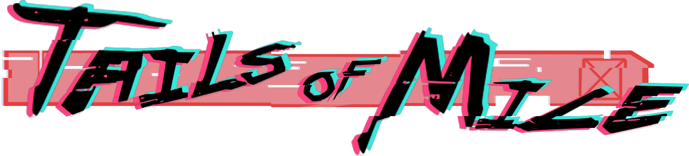

   

# Tails Of Mice

You will play as "BR1E" our small and cybernetically enhanced Mice as you endlessly fight away on an arena in the sewers underneath the mega cyber city you live in.
Defeat waves of enemies and gain score in order to register your name in the leaderboards!

This is a game being developed by students from <a href="https://www.imagecampus.edu.ar/">Image Campus</a>

   

## Credits

- **Guido Tello** - *Programming*
- **Francisco Cavenaghi** - *Programming*
- **Facundo Fonseca** - *Art*
- **Gastón Camacho** - *Art*
- **Olivia Fainberg** - *Art*
- **Juan Pablo Kavulakian** - *Game Design*
- **Joaquín Beccar Varela** - *Game Design*
- **Joaquin Orriols** - *Game Design*
- **Juliana Grisolia** - *Game Design*
- **Rodrigo Abrahan Cerimeli** - *Audio*
- **Pablo Julian Luna** - *Audio*

This game was also possible thanks to the support of these professors:

- **Rodrigo Magariños** - *Professor*
- **Matias Ruiz Torres** - *Professor*
- **Julian Bega** - *Professor*
- **Sofia Albano** - *Art*

## Links

Download it from itch.io: https://jpkavulakian.itch.io/tails-of-mice
 
